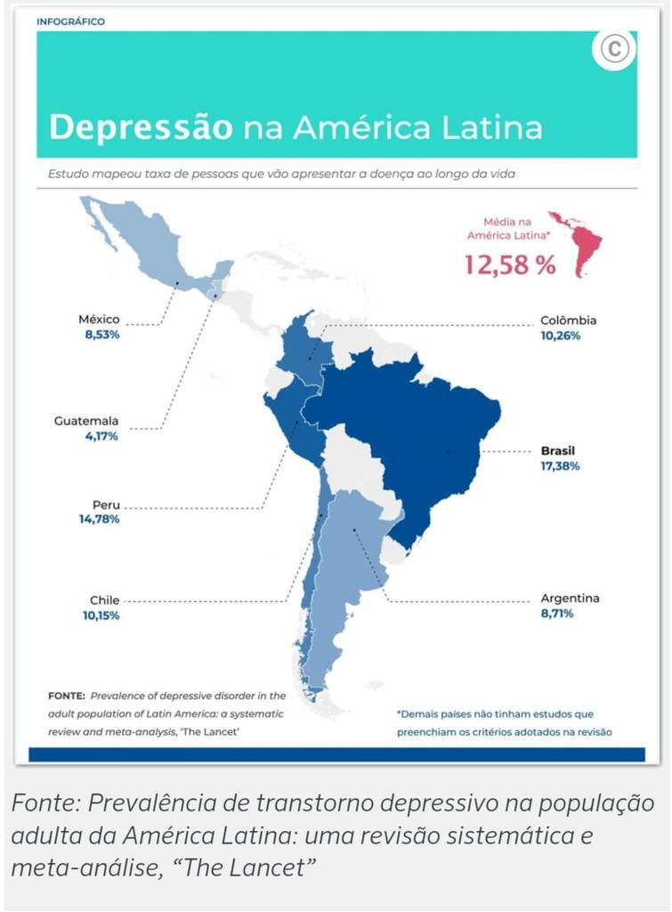

# Projeto SocialWell


[Nosso site: www.socialwell.com.br](https://www.socialwell.com.br/).

[Protótipo do projeto](https://miro.com/app/board/uXjVNK0yotw=/?share_link_id=271284827259)

Uma plataforma para promover bem-estar digital e saúde mental, integrando diversas tecnologias. Em um mundo cada vez mais conectado, estamos comprometidos em ajudá-lo a navegar pelas águas digitais com equilíbrio e bem-estar.


## Participe da Nossa Pesquisa!
Ajude-nos a entender melhor suas necessidades e expectativas participando da nossa pesquisa. [Clique aqui para acessar a pesquisa](https://docs.google.com/forms/d/e/1FAIpQLScNYCNdQuag83_Mn0PcLZGm21tjVQrWSv5K81mxZiuXl28HJw/viewform).
## Tecnologias Utilizadas

- **Front-end (Site em Laravel):** A interface do usuário do SocialWell é desenvolvida em Laravel, fornecendo uma experiência amigável e responsiva.

- **Back-end (API Python):** O back-end do projeto é construído em Python e integra as APIs do Instagram e Spotify para coletar e processar dados relevantes.

- **Machine Learning (Scikit-Learn):** Utilizamos a biblioteca Scikit-Learn para tratar e analisar dados, promovendo a saúde mental dos usuários.

- **Banco de Dados (MySQL):**

Os dados tratados são armazenados em um banco de dados MySQL.

- **Aplicativo (React Native):** Nosso aplicativo em React Native é o coração de nossa plataforma, fornecendo uma experiência eficiente e responsiva aos nossos usuários.


# Modelo padrão de utilização do site


Modelo laravel + vuejs3 padrão já configurado para utilização com quasar e tailwind css configurados.


- Laravel 10
- PHP 8.1
- Vuejs3
- Quasar
- Tailwind Css

## Clone

```bash
git clone https://github.com/aristotelesfl/SocialWell.git
```

## Instalação

```bash
cd /site-socialwell

composer install

php artisan serve
```

## Código Style para remover bugs css do quasar

```bash

<style>
[type='text']:focus, [type='email']:focus, [type='url']:focus, [type='password']:focus,
[type='number']:focus, [type='date']:focus, [type='datetime-local']:focus, [type='month']:focus,
[type='search']:focus, [type='tel']:focus, [type='time']:focus, [type='week']:focus, [multiple]:focus,
textarea:focus, select:focus{
    --tw-ring-shadow: 0;
}
</style>

```
